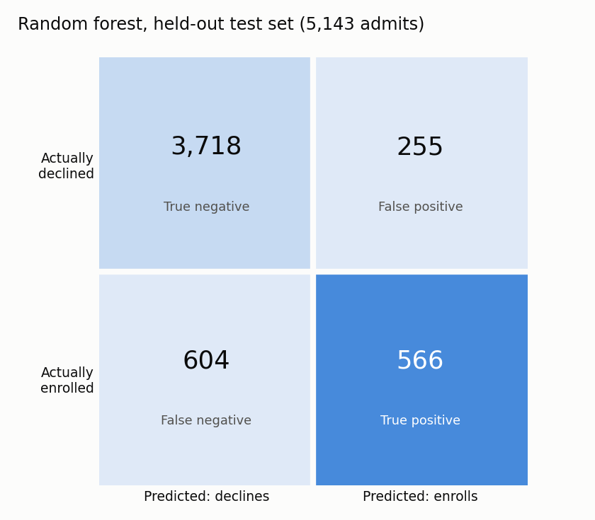
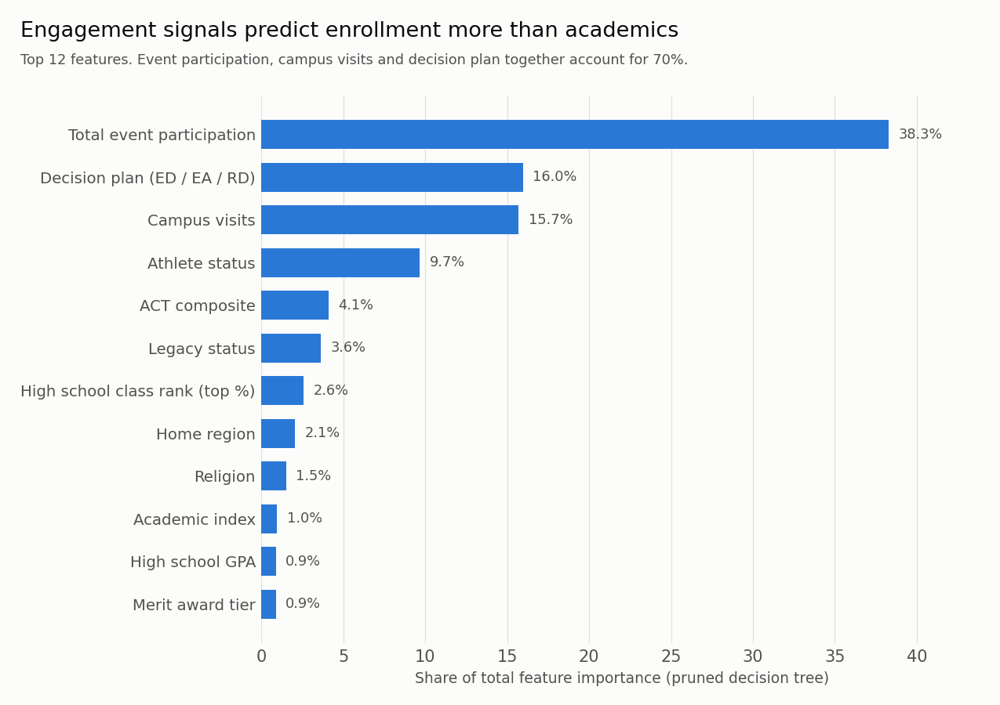

# Predicting Which Admitted Students Will Enroll

**A classification model that predicts college yield (whether an admitted applicant will enroll) from five years of admissions records. It shows that engagement with the university predicts enrollment far better than academic credentials do.**

> Individual course project, Trinity University (Spring 2025)

---

## The problem

Admitting a student is only half the job. Most admitted students go somewhere else: in this data, **only about 22% of admits enrolled**. An admissions office that can tell which admits are likely to enroll can plan class size, target outreach to undecided students, and put its recruiting budget where it moves the needle.

The task: using information collected during the application cycle, **predict whether an admitted first-year applicant will enroll** (`Decision = 1`) for entry terms Fall 2017 through Fall 2021.

## Results

Three tree-based models were evaluated on a **held-out test set of 5,143 admits**. The majority-class baseline (predict that no one enrolls) is 77.3% accurate, so accuracy alone says little here. **Cohen's kappa**, which measures agreement beyond chance, was the selection metric.

| Model | Accuracy | Precision | Recall | F1 | Kappa |
|---|---|---|---|---|---|
| Baseline: predict "declines" for everyone | 0.773 | — | 0.00 | — | 0.00 |
| Decision tree (unpruned) | 0.752 | 0.46 | 0.49 | 0.47 | 0.31 |
| Decision tree (cost-complexity pruned) | 0.820 | 0.65 | 0.45 | 0.53 | 0.43 |
| **Random forest (100 trees, 6 features per split)** | **0.833** | **0.69** | **0.48** | **0.57** | **0.47** |

In plain terms: **when the random forest flags a student as likely to enroll, it is right about 7 times in 10**, and it catches roughly half of all students who actually enroll. That is useful for prioritizing outreach, but not reliable enough to forecast class size on its own.

<p align="center">
  
</p>

### What predicts enrollment



The strongest signals are about **engagement with the university**, not academic credentials:

- **Event participation.** In the training data, admits who attended no events enrolled at 13%. One event raised that to 43%, and two or more to about 63%.
- **Decision plan.** Early Decision admits, who commit in advance, enrolled at 94%, compared with 20% for Early Action and 16% for Regular Decision.
- **Campus visits.** Admits who never visited enrolled at 15%. Admits who visited at least once enrolled at 36–53%.
- **Athlete status** is the fourth-strongest predictor, consistent with recruited athletes having a committed path to the roster.

Test scores, GPA, class rank and merit award tier together account for less than 10% of the model's importance. The admitted pool is already academically filtered, so those variables do little to separate students who enroll from students who don't.

---

## Approach

### 1. Data preparation

The raw file contains 15,143 admitted applicants and **69 columns**: demographics, application details, athletics, academic interests, high school records, test scores, geography, financial aid intent and merit awards. Every column was reviewed individually and then kept, transformed or dropped, with the reasoning documented in the notebook.

| Problem | Treatment |
|---|---|
| Mixed ACT and SAT reporting | Filled missing ACT composites by converting SAT scores with the official ACT–SAT concordance table, giving one comparable test score |
| Class rank without context | Converted rank and class size into a **top-percent-in-class** measure, and filled missing values using the average for the student's academic index group |
| Raw timestamps | Engineered **submission-to-inquiry** and **submission-to-first-contact** lead times, then dropped the raw dates |
| High-cardinality categoricals | Merged 30+ merit award codes into award tiers, rolled geomarkets up to U.S. Census regions, grouped business majors, and folded race categories with fewer than 100 cases into "Others" |
| Sparse or redundant columns | Dropped Sport 2 and 3 ratings (under 0.5% filled), school codes (78% missing), the unadjusted GPA columns, SAT section scores, and admissions staff assignments |
| Missing categoricals | Filled with explicit "Not specified", "No Sport" or "Non-Athlete" labels |

The test set was cleaned with the same pipeline as the training set, reusing the category groupings learned from the training data.

### 2. Modeling

- **Train/test split:** 10,000 / 5,143, predefined in the source data.
- **Decision tree:** fully grown as a baseline, then **cost-complexity pruned**, with α chosen by sweeping the pruning path.
- **Random forest:** 100 trees, with `max_features` tuned by sweeping every value from 1 to the full feature count.
- **Selection metric:** Cohen's kappa, because enrollment is imbalanced (22% positive).

### 3. Refinement rounds

| Round | Change | RF test kappa |
|---|---|---|
| Initial | All cleaned features | 0.463 |
| Refinement 1 | Dropped 7 features the pruned tree gave zero importance, including sex, race, citizenship and application source | 0.463 |
| Refinement 2 | Winsorized GPA, ACT and class-rank outliers, and added binned versions | 0.469 |

Both refinements left performance essentially unchanged. Refinement 1 is still worthwhile: the model reaches the same accuracy **without using sex, race or citizenship as inputs**, which matters for a model that could influence how a university treats applicants.

## Limitations and next steps

- **Hyperparameters were tuned on the test set.** The pruning α and random forest `max_features` were both chosen by test-set kappa, so the reported test metrics are somewhat optimistic. The next step is k-fold cross-validation on the training set, with the test set used once at the end.
- **Label encoding.** Categoricals were label-encoded, which imposes an arbitrary order, and separate encoders were fit on train and test. That can map the same category to different codes if the two sets have different category lists. One-hot encoding, or an encoder fit on the training data only, would be safer.
- **The random forest memorizes the training set** (training accuracy 1.00). Limiting tree depth or leaf size would narrow the gap between training and test performance.
- **Recall is modest.** The model misses about half of the students who enroll. Lowering the decision threshold would trade precision for recall, and the right balance depends on what an admissions office does with the flags.
- **Religion and ethnicity are still among the inputs.** Their influence is small, but any operational use of the model would need a fairness review before sensitive attributes are used in decisions about applicants.

## Repository structure

```
├── notebooks/
│   └── admissions_yield_model.ipynb   Full workflow: column-by-column cleaning of the
│                                      train and test sets → decision tree → pruned
│                                      tree → random forest → two refinement rounds
├── data/
│   └── README.md                      Data is confidential and not included (see below)
├── figures/                           Exported result charts
├── requirements.txt
└── README.md
```

## Data availability

The dataset is **confidential student-level admissions data** provided by Trinity University for coursework. It includes demographic and academic records, so it is **not included in this repository**. Outputs in the notebook's data-cleaning section have been cleared so that no individual records appear; the modeling outputs and all code are intact.

To run the notebook with authorized access, place `TU.csv` in `data/` and run the cells from top to bottom.

## Tech stack

`pandas` · `numpy` · `scikit-learn` · `scipy` · `matplotlib` · `seaborn`

## Author

**Sebastian Trevino**
Trinity University, San Antonio TX
